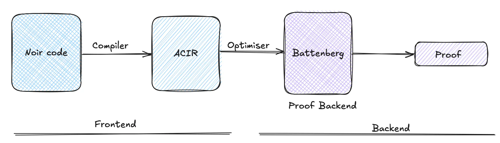
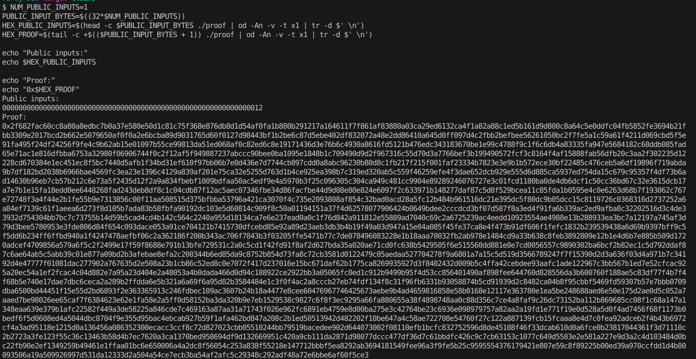
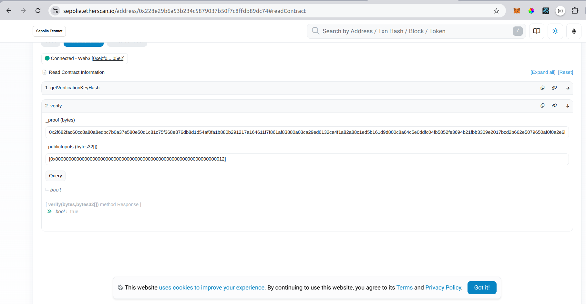

# Getting Started with Noir

## Prerequisites

Before you begin, ensure you have the following installed:

- [Rust](https://www.rust-lang.org/tools/install)
- [Nargo](https://noir-lang.org/docs/getting_started/quick_start#noir)
- [Foundry](https://book.getfoundry.sh/getting-started/installation)
- [Anvil](https://book.getfoundry.sh/anvil/)

---

## What is Noir?

Noir is a domain-specific language (DSL) for zero-knowledge (ZK) programming, designed to simplify the creation of ZK circuits. Released in October 2022, Noir provides a high-level programming experience similar to Rust, with platform-agnostic compilation that enables developers to build ZK proofs on various proving systems.

---

## Key Concepts

### Zero-Knowledge Proofs (ZKP)

A zero-knowledge proof is a cryptographic protocol where a prover demonstrates knowledge of a fact without revealing any information about the fact itself.

**Properties of ZKP:**

- **Privacy:** The verifier learns nothing about the actual data.
- **Succinctness:** Verifying the proof is computationally cheaper than directly verifying the data.

### zkSNARK

**Zero-Knowledge Succinct Non-Interactive Arguments of Knowledge (zkSNARK)** are a specific type of ZKP with:

- **Privacy:** No information about the data is revealed.
- **Succinctness:** Proofs are small and quick to verify.
- **Efficiency:** Proving and verifying is computationally efficient.

---

## Noir Overview

### Core Features

- **Rust-Like Syntax:** Noir adopts Rust’s syntax for familiarity but includes specific constructs for cryptographic applications.
- **Platform Agnostic:** Noir compiles programs to an intermediate representation (ACIR), which can then be used with different backends to create machine-specific proofs.

### Data Types in Noir

1. **Field Elements**: Represent the native field type of the proving backend. Example:
   ```rust
   fn main(x: Field, y: Field) {
       let z = x + y;
   }
   ```
2. **Unsigned and Signed Integers**: Noir supports `u8`, `u16`, `i8`, `i16`, etc., as abstractions over field elements.
3. **Boolean (`bool`)**: For true/false values.
4. **Compound Types**: Arrays, tuples, and structs are supported, with arrays being fixed-size.

### Functions

The `main` function serves as the entry point but has restrictions, such as disallowing variable-sized arrays as parameters.

---

## Getting Started

### Setup: Install and Initialize Noir Project

Use Noir’s package manager, [nargo](https://noir-lang.org/docs/reference/nargo_commands#nargo), to set up a new project:

```bash
nargo new hello_world
```

This creates:

- **`src/main.nr`**: The boilerplate circuit file.
- **`Nargo.toml`**: Configuration file with project metadata.

### Write a Basic Program

Example: Simple Arithmetic Check

```rust
fn main(age: u8, min_age: pub u8) {
    assert(age >= min_age);
}

#[test]
fn test_main() {
    main(12, 10);
}
```

Here min_age is explicity set to public. while we generate the proof age is not revealed while the min_age is public anyone can verify it.

1. **Check for Errors**:

   ```bash
   nargo check
   ```

   Output:

   ```
   [hello_world] Constraint system successfully built!
   ```

   this would create Prover.toml file

2. **Provide Input Values**: Add values to `Prover.toml`:

   ```toml
   age="24"
   min_age="18"
   ```

3. **Compile and Execute**:

   ```bash
   nargo execute
   ```

   Output:

   ```
   [hello_world] Circuit witness successfully solved
   [hello_world] Witness saved to <path-of-your-project>/target/hello_world.gz
   ```

   The witness corresponding to this execution will then be written to the file ./target/hello-world.gz & the compiled artifacts being written to the file ./target/hello_world.json.

### Prove and Verify

1. **Generate Proof**:

   ```bash
   bb prove -b ./target/hello_world.json -w ./target/hello_world.gz -o ./target/proof
   ```

2. **Generate Verification Key**:

   ```bash
   bb write_vk -b ./target/hello_world.json -o ./target/vk
   ```

3. **Verify Proof**:

   ```bash
   bb verify -k ./target/vk -p ./target/proof
   ```

   You have now created and verified a proof for your very first Noir program, i.e you can now reveal someone you are adult without actually proving your age.

---

## Compilation Flow

Noir compiles to an intermediate representation called **Abstract Circuit Intermediate Representation (ACIR)**, which is then processed by backends to generate machine code for specific architectures.

### Visual Representation



---

## Working with Smart Contracts

Noir can generate a verifier contract in Solidity, deployable on EVM-compatible blockchains such as Ethereum.

### Verifying On-Chain with Smart Contracts

```bash
nargo compile
bb write_vk -b ./target/hello_world.json
bb contract
```

A `contract.sol` file will be generated in your project’s directory. This Solidity verifier contract can be deployed to any EVM blockchain.

#### Foundry Setup

```bash
mkdir onchain-verification
cd onchain-verification
forge init --force
cd src
cp ../../target/contract.sol contract.sol
```

This copies `contract.sol` into your Foundry project.

#### Create a Deployment Script

```solidity
// SPDX-License-Identifier: UNLICENSED
pragma solidity ^0.8.13;

import {Script, console} from "forge-std/Script.sol";
import {UltraVerifier} from "../src/contract.sol";

contract UltraVerifierDeployer is Script {

    function setUp() public {}

    function run() public {
        vm.startBroadcast();
        UltraVerifier verifier = new UltraVerifier();
        console.log("Contract deployed at:", address(verifier));
        vm.stopBroadcast();
    }
}
```

#### Deploy Contract Locally

1. Start a local blockchain using Anvil:

   ```bash
   anvil
   ```

2. Deploy the contract:

   ```bash
   forge script script/deployment.s.sol --fork-url http://localhost:8545 --broadcast
   ```

#### Deploying to Sepolia or Your Favorite EVM Chain

1. Create an `.env` file:

   ```bash
   touch .env
   ```

   Add the following values:

   ```
   PRIVATE_KEY=your_private_key
   RPC_URL=https://rpc.testnet.chain
   ETHERSCAN_API_KEY=your_etherscan_api_key (optional if you want to verify the contract)
   ```

   Gas costs are an essential consideration when deploying and interacting with smart contracts. For example, deploying the verifier contract may require approximately **2,525,683 gas units**, which on Sepolia costed me **0.33 ETH** (around three day's of faucet collection), due to unexpected high gas price. Always ensure your account has sufficient funds to cover these costs.

2. Deploy the contract:

   ```bash
   source .env
   forge script script/deployment.s.sol --rpc-url $RPC_URL --private-key $PRIVATE_KEY --broadcast
   ```

   Sample Output:

   ```
   Contract deployed at: 0x228e29b6a53b234C5879037b50F7c8FFdB89DC74
   ```

3. Verify the contract on Etherscan:

   ```bash
   forge verify-contract --chain-id <chain_id> \
   --rpc-url $RPC_URL \
   --etherscan-api-key $ETHERSCAN_API_KEY \
   <contract_address> src/contract.sol:UltraVerifier
   ```

---

### Interacting with the Smart Contract

Once deployed, you can interact with the smart contract using either UI or scripts (Foundry, Hardhat or simple ethers/web3js scripts). For example, you can verify proofs directly through the contract functions:

1. Extract public inputs and proofs:

   ```bash
   NUM_PUBLIC_INPUTS=1
   PUBLIC_INPUT_BYTES=$((32*$NUM_PUBLIC_INPUTS))
   HEX_PUBLIC_INPUTS=$(head -c $PUBLIC_INPUT_BYTES ./proof | od -An -v -t x1 | tr -d $' \n')
   HEX_PROOF=$(tail -c +$(($PUBLIC_INPUT_BYTES + 1)) ./proof | od -An -v -t x1 | tr -d $' \n')

   echo "Public inputs:"
   echo $HEX_PUBLIC_INPUTS

   echo "Proof:"
   echo "0x$HEX_PROOF"
   ```

   Output:
   

2. Since we have already verified the smartcontract, we can verify the proof on etherscan, like in our case our contract we can [verify using etherscan](https://sepolia.etherscan.io/address/0x228e29b6a53b234c5879037b50f7c8ffdb89dc74#readContract#F2).

Output :


3. Interact with Smart Contract using Foundry

Add interact.s.sol in the ./script

```javascript
// SPDX-License-Identifier: UNLICENSED
pragma solidity ^0.8.13;

import {Script} from "forge-std/Script.sol";
import {UltraVerifier} from "../src/contract.sol";
import {console} from "forge-std/console.sol";

contract UltraVerifierInteraction is Script {
    function setUp() public {}
    // your contract address
    address constant CONTRACT_ADDRESS =
        0x228e29b6a53b234C5879037b50F7c8FFdB89DC74;
    function run() public {
        UltraVerifier verifier = UltraVerifier(CONTRACT_ADDRESS);
        bytes32 verificationKeyHash = verifier.getVerificationKeyHash();
        console.logBytes32(verificationKeyHash);
        bytes
            memory proof = hex"<your-proof>";
            // public input
        bytes32 publicInput = 0x0000000000000000000000000000000000000000000000000000000000000012;
        bytes32[] memory publicInputs = new bytes32[](1);
        publicInputs[0] = publicInput;

        bool result = verifier.verify(proof, publicInputs);
        console.log("Verification result:", result);
    }
}
```

Replace the contract address, proof and public input starting with `0x` , if you have multiple public input you can add them in the `publicInputs`.

Run verification :

```
forge script script/interact.s.sol --fork-url $RPC_URL --broadcast -vvvv
```

Sample Output :

```bash
[⠊] Compiling...
[⠊] Compiling 1 files with Solc 0.8.26
[⠒] Solc 0.8.26 finished in 852.10ms
....
Script ran successfully.

== Logs ==
  0x08c94dc7be784fae29f2c31138f359e51b5f02bb35b97795173de24b1c9f2ff4
  Verification result: true
```

### Generating and Verifying Proof at Client Side

To generate and verify proofs on the client side, follow these steps:

> **Warning**
> To run this client side frontend your nargo compiler should have version : 1.0.0-beta.0

1. **Create a `package.json` file**:

   ```json
   {
     "dependencies": {
       "@aztec/bb.js": "0.63.1",
       "@noir-lang/noir_js": "1.0.0-beta.0",
       "@noir-lang/noir_wasm": "1.0.0-beta.0"
     }
   }
   ```

   Install the packages:

   ```bash
   npm install
   ```

2. **Create a `vite.config.js` file**:

   ```javascript
   export default { optimizeDeps: { esbuildOptions: { target: "esnext" } } };
   ```

3. **Create an `index.html` file**:

   ```html
   <!DOCTYPE html>
   <html>
     <head>
       <style>
         body {
           font-family: Arial, sans-serif;
           margin: 0;
           padding: 0;
           background-color: #f5f5f5;
           display: flex;
           flex-direction: column;
           align-items: center;
           justify-content: center;
           height: 100vh;
         }
         h1 {
           color: #333;
           margin-bottom: 20px;
           text-align: center;
         }
         .input-area {
           display: flex;
           flex-direction: column;
           align-items: center;
           gap: 10px;
           background-color: #fff;
           padding: 20px;
           border-radius: 8px;
           box-shadow: 0 4px 6px rgba(0, 0, 0, 0.1);
           border: 1px solid #ddd;
         }
         input[type="number"] {
           width: 200px;
           padding: 10px;
           font-size: 16px;
           border: 1px solid #ccc;
           border-radius: 5px;
           box-shadow: inset 0 1px 3px rgba(0, 0, 0, 0.1);
         }
         input[type="number"]:focus {
           border-color: #007bff;
           outline: none;
           box-shadow: 0 0 4px rgba(0, 123, 255, 0.5);
         }
         button {
           background-color: #007bff;
           color: #fff;
           border: none;
           border-radius: 5px;
           padding: 10px 15px;
           font-size: 16px;
           cursor: pointer;
           transition: background-color 0.3s ease;
         }
         button:hover {
           background-color: #0056b3;
         }
       </style>
     </head>
     <body>
       <script type="module" src="/index.js"></script>
       <h1>Verify Age with Noir</h1>
       <div class="input-area">
         <input id="age" type="number" placeholder="Enter age" />
         <button id="submit">Submit Age</button>
       </div>
     </body>
   </html>
   ```

4. **Create an `index.js` file**:

   ```javascript
   import { createFileManager } from "@noir-lang/noir_wasm";
   import circuitJson from "./target/hello_world.json";
   import initNoirC from "@noir-lang/noirc_abi";
   import initACVM from "@noir-lang/acvm_js";
   import acvm from "@noir-lang/acvm_js/web/acvm_js_bg.wasm?url";
   import noirc from "@noir-lang/noirc_abi/web/noirc_abi_wasm_bg.wasm?url";
   import { UltraHonkBackend } from "@aztec/bb.js";
   import { Noir } from "@noir-lang/noir_js";

   await Promise.all([initACVM(fetch(acvm)), initNoirC(fetch(noirc))]);

   async function getCircuit() {
     const fm = createFileManager("/");
     if (circuitJson) {
       return { program: circuitJson };
     }
     return await compile(fm);
   }

   function uint8ArrayToHex(uint8Array) {
     return Array.from(uint8Array)
       .map((byte) => byte.toString(16).padStart(2, "0"))
       .join("");
   }

   document.getElementById("submit").addEventListener("click", async () => {
     try {
       const { program } = await getCircuit();
       const noir = new Noir(program);
       const backend = new UltraHonkBackend(program.bytecode);
       const age = document.getElementById("age").value;
       const { witness } = await noir.execute({ age, min_age: 18 });
       const proof = await backend.generateProof(witness);
       console.log(proof);
       console.log(uint8ArrayToHex(proof.proof));
       const isValid = await backend.verifyProof(proof);
       alert(isValid ? "Valid" : "Invalid");
     } catch (err) {
       console.error(err);
       if (err.message == "Cannot satisfy constraint") {
         alert(err.message);
         return;
       } else {
         alert("Something went wrong 💔");
       }
     }
   });
   ```

5. **Run the application**:

   ```bash
   bunx vite
   ```

This setup allows you to generate and verify proofs directly in the browser using Noir and the UltraHonk backend.

<details>
<summary>Code Explanation</summary>

## Initial Setup

1. **WASM Initialization**

   ```javascript
   await Promise.all([initACVM(fetch(acvm)), initNoirC(fetch(noirc))]);
   ```

- WASM modules must be fully loaded before any circuit operations
- Using `Promise.all` ensures both modules initialize concurrently
- The `fetch` calls load the WASM binary files
- `initACVM` and `initNoirC` prepare the WebAssembly environment
- `initNoirC`: Initializes Noir's Application Binary Interface (ABI)
- `initACVM`: Sets up the Abstract Circuit Virtual Machine
- Both must be initialized using `Promise.all([initACVM(fetch(acvm)), initNoirC(fetch(noirc))])`

## Core Components

1. **Key Imports**
   - `UltraHonkBackend` (@aztec/bb.js): Handles proof generation and verification
   - `Noir` (@noir-lang/noir_js): Manages circuit compilation and witness generation

## Workflow Steps

1. **Circuit Preparation**

   ```javascript
   const program = await getCircuit();
   const noir = new Noir(program);
   const backend = new UltraHonkBackend(program.bytecode);
   ```

   - Fetch and compiled circuit (`hello_world.json`) using `getCircuit()`
   - Create instances:
     - Noir instance: `new Noir(program)` - Creates a Noir instance to interact with the circuit
     - Backend: `new UltraHonkBackend(program.bytecode)` - Initializes the proving system (UltraHonk) that will generate and verify proofs

2. Witness Generation

   ```javascript
   const witness = await noir.execute({
     age: inputAge,
     min_age: 18,
   });
   ```

The witness generation:

- Takes your input values (like age)
- Runs them through the circuit constraints
- Creates a "witness" - a mathematical representation proving you know values that satisfy the circuit
- If the inputs don't satisfy the constraints (e.g., age < 18), it will fail here

3. Proof Generation

   ```javascript
   const proof = await backend.generateProof(witness);
   ```

This step:

- Takes the witness (which contains all the information)
- Creates a compressed cryptographic proof
- This proof demonstrates knowledge of valid inputs without revealing them
- Much smaller than the witness and suitable for verification

4. Proof Verification

   ```javascript
   const verified = await backend.verifyProof(proof);
   ```

The verification:

- Checks if the proof is valid mathematically
- Returns true only if the proof was generated correctly
- Doesn't need the original inputs, just the proof

</details>

## Learn More

1. [Official Documentation](https://noir-lang.org/docs/getting_started/quick_start)
2. [Notion Note by](https://zkshark.notion.site/Hot-Chocolate-Beginners-guide-14907561ca1a80e68bd1d9245a53fd95) by [@abix](https://x.com/0xabix)
3. [Building a web app with NoirJS](https://noir-lang.org/docs/tutorials/noirjs_app)

## Conclusion

Congratulations! You have successfully created, proved, and verified a zero-knowledge proof using Noir. You have also deployed and interacted with a verifier smart contract on an EVM-compatible blockchain. You have also built a client side UI to interact with Noir Circuit!!

Continue exploring the capabilities of Noir and zero-knowledge proofs to build more complex and privacy-preserving applications.

Happy coding!
